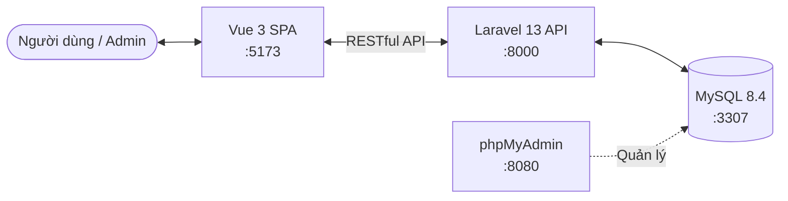

# EcomFashion - Tài liệu Kiến trúc Hệ thống (System Architecture)

Tài liệu này mô tả chi tiết kiến trúc, cấu trúc thư mục, luồng hoạt động và các công nghệ sử dụng trong dự án **EcomFashion**.

---

## 1. Tổng Quan Hệ Thống

Dự án **EcomFashion** được xây dựng theo mô hình **Client-Server tách biệt** (Decoupled Architecture) với hai phần chính:
- **Backend**: API Server được xây dựng bằng framework **Laravel 13** phục vụ dữ liệu dưới dạng RESTful API JSON.
- **Frontend**: Single Page Application (SPA) xây dựng bằng **Vue 3 (Vite)** + **TailwindCSS v4**, quản lý trạng thái bằng **Pinia** và điều hướng bằng **Vue Router**.

Cả hệ thống được đóng gói và vận hành đồng bộ thông qua **Docker Compose**, giúp triển khai dễ dàng mà không phụ thuộc vào môi trường máy local của lập trình viên.



---

## 2. Kiến Trúc Backend (Laravel 13)

Thành phần Backend được tổ chức chặt chẽ theo mô hình **Layered Architecture** nhằm tối ưu hóa tính độc lập, dễ viết Unit Test và bảo trì lâu dài.

### 2.1 Luồng Xử Lý Dữ Liệu (Request-Response Flow)

Mọi HTTP request từ frontend gửi tới backend sẽ đi qua luồng tuần tự sau:

```mermaid
graph TD
    Client[Client / Frontend] -->|1. HTTP Request| Routes[Routes - routes/api.php]
    Routes -->|2. Route Matching| Request[Form Requests - validation]
    Request -->|3. Validated Data| Controller[Controllers - HTTP handler]
    Controller -->|4. Call Method| ServiceInterface[Service Interface]
    ServiceInterface -->|Bind| ServiceImpl[Service Implementation - Business Logic]
    ServiceImpl -->|5. Query Operation| RepoInterface[Repository Interface]
    RepoInterface -->|Bind| RepoImpl[Repository Implementation - SQL Queries]
    RepoImpl -->|6. Query Eloquent| Model[Eloquent Models]
    Model <-->|7. SQL Command| DB[(MySQL Database)]
    RepoImpl <--|Return Model/Collection| Model
    ServiceImpl <--|Return Processed Data| RepoImpl
    Controller <--|Return Data| ServiceImpl
    Controller -->|8. Formats Response| Resource[API Resources]
    Resource -->|9. JSON Response| Client
```

### 2.2 Các Thành Phần Trong Lớp Backend
- **Routes (`backend/routes/api.php`)**: Định nghĩa các endpoint của API, phân nhóm chức năng (ví dụ: `/api/admin/*`) và áp dụng Middleware tương ứng (như authentication, CORS).
- **Form Requests (`backend/app/Http/Requests`)**: Đảm nhận nhiệm vụ xác thực (Validation) và phân quyền kiểm duyệt dữ liệu thô đầu vào trước khi đưa vào Controller.
- **Controllers (`backend/app/Http/Controllers`)**: Tiếp nhận dữ liệu đã kiểm duyệt từ Form Request, gọi Service tương ứng xử lý và định dạng cấu trúc JSON trả về client.
- **Service Layer (`backend/app/Services`)**: Chứa toàn bộ logic nghiệp vụ (Business Logic). Tách biệt thành `Interfaces` để khai báo các nghiệp vụ và `Implements` chứa logic thực tế.
- **Repository Layer (`backend/app/Repositories`)**: Đóng gói toàn bộ các truy vấn cơ sở dữ liệu sử dụng Eloquent ORM. Giúp Service Layer hoàn toàn độc lập với việc truy vấn cơ sở dữ liệu.
- **Models (`backend/app/Models`)**: Định nghĩa cấu trúc các thực thể dữ liệu, quan hệ (relationships) giữa các bảng và các thuộc tính fillable/casts.

> [!NOTE]
> Việc liên kết (Binding) các Interface với Class Implementation cụ thể được thực hiện tập trung tại `AppServiceProvider.php` ([AppServiceProvider.php](file:///d:/Ecom_Fashion/backend/app/Providers/AppServiceProvider.php)) trong phương thức `register()`.

### 2.3 Các Thực Thể Cơ Sở Dữ Liệu Chính (Models)
1. **User**: Quản lý tài khoản khách hàng đăng nhập hệ thống.
2. **Customer**: Quản lý hồ sơ chi tiết khách hàng mua sắm.
3. **Staff**: Quản lý tài khoản nhân viên quản trị hệ thống.
4. **Category**: Các danh mục sản phẩm (hỗ trợ phân cấp cha-con).
5. **Product**: Thông tin sản phẩm chính.
6. **ProductImage**: Bộ sưu tập hình ảnh liên kết với từng sản phẩm.
7. **ProductVariant**: Các phiên bản biến thể cụ thể của sản phẩm (ví dụ: Áo thun đỏ - Size M).
8. **Attribute**: Các thuộc tính chung của sản phẩm (ví dụ: Kích thước, Màu sắc).
9. **AttributeValue**: Giá trị cụ thể của thuộc tính (ví dụ: S, M, L, Đỏ, Đen).
10. **Coupon**: Các mã giảm giá áp dụng khi thanh toán.

---

## 3. Kiến Trúc Frontend (Vue 3 + Vite)

Frontend được xây dựng bằng mô hình Component-Driven với cấu trúc tổ chức module chặt chẽ dựa trên các chuẩn cấu trúc Single Page Application hiện đại.

### 3.1 Cấu Trúc File & Thư Mục Nổi Bật (`frontend/src/`)
- **router/ (`frontend/src/router`)**: Định nghĩa hệ thống định tuyến phía Client. Được chia nhỏ thành:
  - `index.js`: Điểm khởi chạy của Vue Router.
  - `adminRoutes.js`: Định nghĩa các tuyến đường cho trang quản trị Admin (Dashboard, Products, Category, Staff,...).
  - `clientRoutes.js`: Định nghĩa các tuyến đường cho trang mua sắm phía khách hàng.
- **views/ (`frontend/src/views`)**: Chứa các component đại diện cho toàn bộ trang (Pages).
  - `admin/`: Các trang thuộc quản lý nội bộ như Quản lý Sản phẩm, Danh mục, Đơn hàng, Nhân viên.
  - `client/`: Các trang giao diện công khai như Trang chủ, Danh sách sản phẩm, Giỏ hàng, Liên hệ.
- **components/ (`frontend/src/components`)**: Các component dùng chung và có thể tái sử dụng (như nút nhấn, bảng dữ liệu, modal xác nhận, phân trang).
- **stores/ (`frontend/src/stores`)**: Quản lý trạng thái (State Management) tập trung bằng Pinia. Tổ chức theo từng module tương tự thực thể backend (ví dụ: `productStore.js`, `staffStore.js`).
- **services/ (`frontend/src/services`)**: Quản lý các yêu cầu HTTP. 
  - Tách biệt thành `admin/` và `client/` để giữ tính gọn gàng.
  - Chứa `shared/http.js` là file khởi tạo Axios instance cấu hình sẵn `baseURL`, tự động đính kèm `Authorization: Bearer token` từ localStorage, và xử lý lỗi phản hồi tập trung (như tự động chuyển hướng về trang đăng nhập khi nhận HTTP 401).
- **composables/ (`frontend/src/composables`)**: Chứa các hàm tiện ích sử dụng Vue Composition API giúp tái sử dụng logic (hooks) giữa các component khác nhau.

---

## 4. Cấu Hình Môi Trường Docker Compose

Dự án sử dụng tệp `docker-compose.yml` ([docker-compose.yml](file:///d:/Ecom_Fashion/docker-compose.yml)) để liên kết 4 dịch vụ cốt lõi chạy trên các cổng như sau:

| Dịch vụ | Tên Container | Cổng Host | Vai trò |
| :--- | :--- | :--- | :--- |
| **mysql** | `ecom-fashion-mysql` | `3307` | Hệ quản trị cơ sở dữ liệu MySQL 8.4 chứa toàn bộ dữ liệu. |
| **phpmyadmin**| `ecom-fashion-phpmyadmin` | `8080` | Giao diện web quản lý và tương tác trực tiếp với cơ sở dữ liệu. |
| **backend** | `ecom-fashion-backend` | `8000` | Môi trường PHP chạy ứng dụng Laravel và máy chủ API. |
| **frontend** | `ecom-fashion-frontend` | `5173` | Môi trường Node chạy ứng dụng Vue 3 / Vite ở chế độ hot-reload. |

> [!WARNING]
> Do chạy trong môi trường Docker Bridge Network, tệp `.env` của backend sử dụng cấu hình kết nối database thông qua tên dịch vụ làm Host (`DB_HOST=mysql`), trong khi lập trình viên kết nối từ máy local (như dùng TablePlus, DBeaver) sẽ trỏ vào `localhost` ở cổng mapped `3307`.

---

## 5. Sơ Đồ Cấu Trúc Thư Mục Dự Án (Directory Structure Overview)

Dưới đây là cây thư mục trực quan thể hiện kiến trúc của EcomFashion:

```text
Ecom_Fashion/
├── docker-compose.yml              # Quản lý cấu hình container hóa các service
├── README.md                       # Tài liệu hướng dẫn cài đặt và chạy ứng dụng
├── architecture.md                 # [Tệp này] Tài liệu mô tả kiến trúc chi tiết
│
├── backend/                        # --- LARAVEL 13 BACKEND ---
│   ├── app/
│   │   ├── Http/
│   │   │   ├── Controllers/
│   │   │   │   └── Admin/          # Các Controller quản trị hệ thống
│   │   │   ├── Requests/           # Xác thực và phân quyền đầu vào (Form Request)
│   │   │   └── Resources/          # Định dạng đầu ra JSON (Eloquent API Resources)
│   │   │
│   │   ├── Models/                 # Eloquent Models đại diện cấu trúc dữ liệu
│   │   │
│   │   ├── Repositories/           # Data Access Layer (Repository Pattern)
│   │   │   └── Admin/
│   │   │       ├── Implements/     # Triển khai truy vấn cụ thể
│   │   │       └── Interfaces/     # Khai báo các phương thức truy vấn
│   │   │
│   │   ├── Services/               # Business Logic Layer (Service Pattern)
│   │   │   └── Admin/
│   │   │       ├── Implements/     # Triển khai nghiệp vụ hệ thống
│   │   │       └── Interfaces/     # Khai báo nghiệp vụ
│   │   │
│   │   └── Providers/
│   │       └── AppServiceProvider.php  # Binding các Interface với Implementation cụ thể
│   │
│   ├── database/                   # Migrations, Seeders & Factories tạo dữ liệu mẫu
│   ├── routes/
│   │   └── api.php                 # Định nghĩa toàn bộ api endpoint
│   └── Dockerfile                  # Cấu hình build container backend
│
└── frontend/                       # --- VUE 3 FRONTEND ---
    ├── src/
    │   ├── main.js                 # Điểm khởi chạy của ứng dụng frontend
    │   ├── App.vue                 # Root component
    │   │
    │   ├── components/             # Các UI Component dùng chung (Pagination, Modals,...)
    │   ├── composables/            # Reusable Vue hooks (Composition API)
    │   ├── layouts/                # Các Layout hệ thống (AdminLayout, BlankLayout,...)
    │   │
    │   ├── router/                 # Cấu hình Vue Router
    │   │   ├── index.js
    │   │   ├── adminRoutes.js
    │   │   └── clientRoutes.js
    │   │
    │   ├── services/               # Lớp gọi API (Axios client)
    │   │   ├── admin/              # Service gọi API khu vực admin
    │   │   ├── client/             # Service gọi API khu vực khách hàng
    │   │   └── shared/
    │   │       └── http.js         # Axios instance cấu hình chung cho hệ thống
    │   │
    │   ├── stores/                 # State management (Pinia Stores)
    │   │   └── admin/              # Các store phục vụ dữ liệu admin
    │   │
    │   └── views/                  # Chứa giao diện hiển thị chính
    │       ├── admin/              # Giao diện phía admin (Staff, Products, Categories,...)
    │       └── client/             # Giao diện phía khách hàng (Home, Detail, Blog,...)
    │
    └── Dockerfile                  # Cấu hình build container frontend
```
